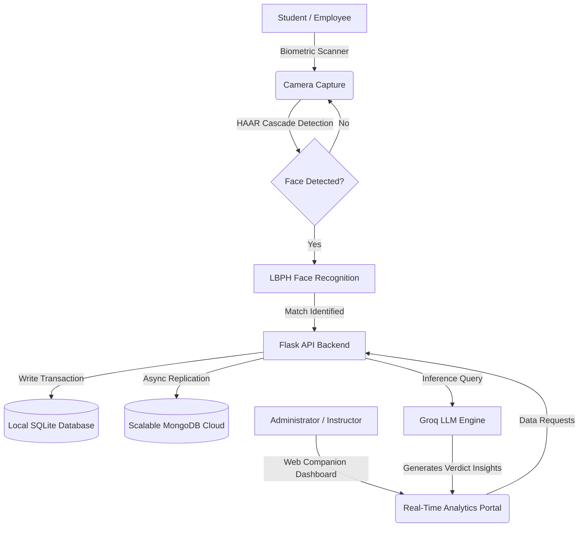

# SmartSlate — AI Face Recognition Attendance Ecosystem

[](https://python.org)
[](https://opencv.org)
[](https://mongodb.com)
[](https://flask.palletsprojects.com)
[](LICENSE)

An advanced, AI-driven attendance and management ecosystem designed for institutional and corporate environments. By leveraging state-of-the-art face recognition technology, it eliminates the need for manual tracking, providing a secure, efficient, and real-time solution for attendance monitoring.

**Developed by [Sriram S](https://sriram.website/)** • **Proprietary Software**

---

## Table of Contents
- [System Architecture](#system-architecture)
- [Key Features](#key-features)
- [Tech Stack](#tech-stack)
- [Database & Data Flow](#database--data-flow)
- [Installation & Configuration](#installation--configuration)
- [License & Intellectual Property](#license--intellectual-property)

---

## System Architecture



---

## Key Features

### 1. Biometric Face Recognition Engine
*   Utilizes optimized **OpenCV** models using **LBPH (Local Binary Patterns Histograms)** for local face recognition.
*   Employs high-speed **HAAR Cascades** to perform real-time, lightweight face detection at the edge.
*   Includes automated validation filters to prevent spoofing.

### 2. Real-Time Attendance Monitoring
*   Sub-second, frictionless user check-in/check-out logs.
*   Administrative web portal showing dynamic charts, live updates, and student logs instantly.
*   Time-stamped database records with precision metrics.

### 3. AI-Driven Analytics & Insight Reports
*   Integration with **Groq LLM** to analyze attendance patterns and generate automated summaries.
*   PDF report compiling with **fpdf2** and statistical analytics via **Pandas**.
*   Identifies outliers, anomalies, and logs absences automatically.

### 4. Multi-Platform Ecosystem
*   **Web Dashboard**: Main control panel for administrators and teachers to run logs.
*   **Teacher Companion App**: Dedicated mobile client built for Android allowing instructors to manage rosters.
*   **Secure API Layer**: High-performance Flask REST API managing computer vision operations and sync mechanisms.

---

## Tech Stack

*   **Language & Backend**: Python 3.10+, Flask, Flask-CORS
*   **Computer Vision**: OpenCV (cv2), NumPy
*   **AI Integration**: Groq API (AttendanceAI Engine)
*   **Database Architectures**: SQLite (Local edge cache), MongoDB (Global cloud metrics)
*   **Mobile Interface**: Android (Kotlin/Java)
*   **Reporting**: fpdf2, Pandas

---

## Project Directory Structure

```text
SmartSlate/
├── backend/                  # Flask REST API Server
│   ├── app.py                # Server entrypoint
│   ├── database/             # SQLite & MongoDB connectivity configs
│   ├── modules/              # OpenCV Recognition & AI reporting logic
│   └── requirements.txt      # Python dependencies
├── teacher_app/              # Android Companion App (Kotlin)
├── frontend/                 # Client deployment files
└── README.md                 # Project Documentation
```

---

## Installation & Configuration

### Prerequisites
*   Python 3.10+
*   Android SDK & Android Studio (for compiling `teacher_app`)
*   MongoDB Atlas cluster connection string

### Setup & Run
1. Clone the repository and navigate to the backend directory:
   ```bash
   cd backend
   ```
2. Install Python dependencies:
   ```bash
   pip install -r requirements.txt
   ```
3. Create your `.env` configuration file:
   ```env
   GROQ_API_KEY=your_groq_api_key_here
   MONGO_URI=your_mongodb_connection_string_here
   ```
4. Run the Flask Server:
   ```bash
   python app.py
   ```

---

## License & Intellectual Property

**Proprietary Portfolio Project** — All rights reserved by **Sriram S**.

This repository is published exclusively for educational review, architectural assessment, and portfolio evaluation. Unauthorized replication, redistribution, commercialization, or modifications of this source code are strictly prohibited without written consent from the author.

*Developed by [Sriram S](https://github.com/SriramGandhiS).*
